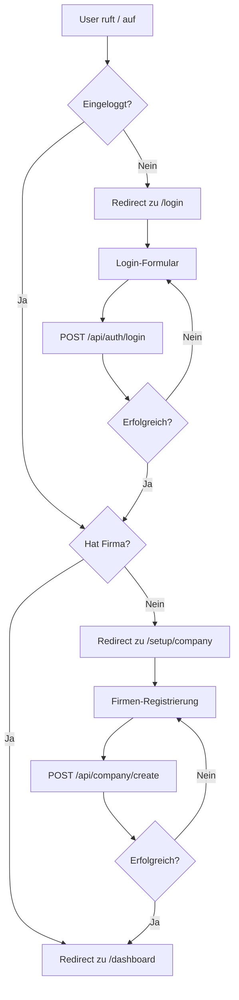

# Projektzeiterfassung 2.0 - MVP Statusbericht & Entwicklungsdokumentation

**Version:** 1.0 (MVP Phase 1)  
**Stand:** 24. November 2025  
**Status:** ✅ Phase 1 komplett funktionsfähig

---

## 1. Executive Summary

### 1.1 Projektziel
Entwicklung eines webbasierten SaaS-Systems zur projektbezogenen Zeiterfassung für kleine und mittlere Unternehmen mit integrierter Feiertags-Logik und mandantenfähiger Architektur.

### 1.2 Aktueller Status
- **Phase 1 (MVP):** ✅ Abgeschlossen
- **Authentifizierung & Firmenverwaltung:** Vollständig implementiert
- **Dashboard:** Grundfunktionalität vorhanden
- **Deployment:** Lokal entwicklungsfähig
- **Produktion:** Noch nicht deployed

### 1.3 Tech-Stack (Aktuell)
- **Frontend:** Next.js 16.0.3 (App Router, TypeScript)
- **Backend:** Supabase (PostgreSQL + Auth + RLS)
- **Package Manager:** pnpm
- **Styling:** Inline-Styles (kein CSS-Framework)
- **Deployment:** Lokal (Dev-Mode)

---

## 2. Funktionale Anforderungen (aus Pflichtenheft V2.1)

### 2.1 Rollenmodell
| Rolle | Rechte | Status |
|-------|--------|--------|
| **Company_Admin** | Firmenverwaltung, Mitarbeiter, Projekte, Workpackages, alle Timesheets | ✅ Implementiert |
| **Employee** | Eigene Timesheets, zugeordnete Projekte | ⏳ Geplant |
| **System_Admin** | Systemweite Administration | ❌ Nicht im MVP |

### 2.2 Kernfunktionalität MVP

#### ✅ Implementiert (Phase 1)
1. **Authentifizierung**
   - Login mit Email/Passwort (Supabase Auth)
   - Automatischer Redirect basierend auf Rollenzuordnung
   - Logout-Funktionalität
   - Session-Management

2. **Firmenverwaltung**
   - Firmen-Registrierung mit vollständigem Datensatz
   - Duplikat-Prüfung (Firmenname + USt-ID)
   - Automatische Zuordnung des Gründers als Company_Admin
   - Adressdaten, Rechtsform, Handelsregister
   - Branchenzuordnung (WZ-Code)

3. **Dashboard**
   - Persönliche Übersicht für eingeloggte User
   - Anzeige von Firmendaten
   - Rollenbasierte Bereichsanzeige (Admin vs. Employee)

4. **Middleware & Route Protection**
   - Automatischer Redirect nicht eingeloggter User zu /login
   - Geschützte Routen für Dashboard/Setup
   - Automatischer Flow: Login → Company vorhanden? → Dashboard

#### ⏳ Geplant (Phase 2+)
5. **Mitarbeiterverwaltung**
   - Anlage neuer Mitarbeiter durch Company_Admin
   - Rollenzuweisung (Company_Admin / Employee)
   - Aktivierung/Deaktivierung

6. **Projektverwaltung**
   - Projektanlage (Titel, Beschreibung, Start-/Enddatum)
   - Workpackage-Verwaltung
   - Zuweisung von Mitarbeitern zu Workpackages

7. **Zeiterfassung**
   - Monatsansicht je Mitarbeiter
   - Buchung auf Workpackages
   - Feiertagslogik (automatische Sperrung)
   - Wochenend-Sperrung
   - Summenbildung

#### ❌ Nicht im MVP
- System_Admin-Rolle
- Abwesenheiten (Urlaub/Krankheit)
- Zahlungsanforderung (ZA)
- Verwendungsnachweis (VN)
- AGVO-Abbildung
- De-minimis-Verwaltung
- Audit-Logs
- Mehrsprachigkeit

---

## 3. Datenmodell

### 3.1 Implementierte Tabellen

#### `companies`
```sql
CREATE TABLE companies (
  id UUID PRIMARY KEY DEFAULT gen_random_uuid(),
  name TEXT NOT NULL,
  street TEXT,
  house_number TEXT,
  zip TEXT,
  city TEXT,
  state_code TEXT, -- z.B. 'DE-BY'
  country TEXT DEFAULT 'DE',
  legal_form TEXT,
  trade_register_city TEXT,
  trade_register_number TEXT,
  vat_id TEXT,
  industry_wz_code TEXT,
  industry_description TEXT,
  email TEXT,
  website TEXT,
  phone_main TEXT,
  phone_mobile TEXT,
  iban TEXT,
  created_at TIMESTAMPTZ DEFAULT NOW(),
  updated_at TIMESTAMPTZ DEFAULT NOW()
);
```

**Constraints:**
- UNIQUE auf `vat_id` empfohlen
- UNIQUE auf `name` (case-insensitive) empfohlen

#### `company_users`
```sql
CREATE TABLE company_users (
  id UUID PRIMARY KEY DEFAULT gen_random_uuid(),
  company_id UUID NOT NULL REFERENCES companies(id) ON DELETE CASCADE,
  user_id UUID NOT NULL REFERENCES auth.users(id) ON DELETE CASCADE,
  role TEXT NOT NULL CHECK (role IN ('company_admin', 'employee')),
  created_at TIMESTAMPTZ DEFAULT NOW(),
  UNIQUE(company_id, user_id)
);
```

**Wichtig:** Diese Tabelle verknüpft Supabase Auth-User mit Firmen.

#### `employees` (vorhanden, aber aktuell ungenutzt)
```sql
CREATE TABLE employees (
  id UUID PRIMARY KEY DEFAULT gen_random_uuid(),
  user_id UUID REFERENCES auth.users(id),
  company_id UUID REFERENCES companies(id),
  email TEXT,
  first_name TEXT,
  last_name TEXT,
  role TEXT,
  is_active BOOLEAN DEFAULT TRUE,
  created_at TIMESTAMPTZ DEFAULT NOW()
);
```

**Status:** Tabelle existiert, wird aber im aktuellen MVP nicht verwendet. Stattdessen wird `company_users` genutzt.

### 3.2 Geplante Tabellen (laut Pflichtenheft)

#### `projects`
```sql
CREATE TABLE projects (
  project_id UUID PRIMARY KEY,
  company_id UUID REFERENCES companies(company_id),
  title TEXT,
  description TEXT,
  start_date DATE,
  end_date DATE
);
```

#### `workpackages`
```sql
CREATE TABLE workpackages (
  wp_id UUID PRIMARY KEY,
  project_id UUID REFERENCES projects(project_id),
  name TEXT,
  description TEXT,
  planned_hours NUMERIC,
  start_date DATE,
  end_date DATE
);
```

#### `workpackage_assignments`
```sql
CREATE TABLE workpackage_assignments (
  assignment_id UUID PRIMARY KEY,
  employee_id UUID REFERENCES employees(employee_id),
  wp_id UUID REFERENCES workpackages(wp_id)
);
```

#### `timesheets`
```sql
CREATE TABLE timesheets (
  timesheet_id UUID PRIMARY KEY,
  employee_id UUID REFERENCES employees(employee_id),
  month INT, -- 1-12
  year INT,
  status TEXT -- draft/submitted/approved
);
```

#### `timesheet_rows`
```sql
CREATE TABLE timesheet_rows (
  row_id UUID PRIMARY KEY,
  timesheet_id UUID REFERENCES timesheets(timesheet_id),
  wp_id UUID REFERENCES workpackages(wp_id),
  work_date DATE,
  hours NUMERIC,
  note TEXT
);
```

#### `holidays`
```sql
CREATE TABLE holidays (
  holiday_id UUID PRIMARY KEY,
  holiday_date DATE,
  holiday_name TEXT,
  state_code TEXT -- z.B. 'DE-BY'
);
```

### 3.3 Weitere Tabellen (vorhanden)
- `federal_states` - Bundesländer-Referenztabelle
- `wz_codes` - WZ-Code-Klassifikation

---

## 4. Technische Architektur

### 4.1 Frontend-Struktur
```
src/
├── app/
│   ├── api/
│   │   ├── auth/
│   │   │   ├── login/route.ts        ✅ Login-Endpoint
│   │   │   └── logout/route.ts       ✅ Logout-Endpoint
│   │   └── company/
│   │       └── create/route.ts       ✅ Firma erstellen
│   ├── dashboard/
│   │   └── page.tsx                  ✅ Dashboard (company_users-basiert)
│   ├── login/
│   │   └── page.tsx                  ✅ Login-Formular
│   ├── setup/
│   │   ├── company/
│   │   │   └── page.tsx              ✅ Firmen-Registrierung
│   │   ├── done/
│   │   │   └── page.tsx              ⏳ Setup-Abschluss
│   │   └── user/
│   │       └── page.tsx              ⏳ User-Anlage
│   ├── layout.tsx                    ✅ Root Layout
│   └── page.tsx                      ✅ Root-Redirect-Logik
├── lib/
│   └── supabase/
│       ├── client.ts                 ✅ Browser-Client
│       └── server.ts                 ✅ Server-Client (Next.js 16 kompatibel)
└── middleware.ts                     ✅ Route Protection
```

### 4.2 Authentication Flow


### 4.3 Supabase Client-Implementierung

#### Server-Side (server.ts)
```typescript
import { createServerClient } from '@supabase/ssr';
import { cookies } from 'next/headers';

export async function createClient() {
  const cookieStore = await cookies();

  return createServerClient(
    process.env.NEXT_PUBLIC_SUPABASE_URL!,
    process.env.NEXT_PUBLIC_SUPABASE_ANON_KEY!,
    {
      cookies: {
        getAll() {
          return cookieStore.getAll();
        },
        setAll(cookiesToSet) {
          try {
            cookiesToSet.forEach(({ name, value, options }) =>
              cookieStore.set(name, value, options)
            );
          } catch {
            // Server Components können keine Cookies setzen
          }
        },
      },
    }
  );
}
```

**Wichtig:** Next.js 16 erfordert `await cookies()`.

#### Client-Side (client.ts)
```typescript
import { createBrowserClient } from '@supabase/ssr';

export function createClient() {
  return createBrowserClient(
    process.env.NEXT_PUBLIC_SUPABASE_URL!,
    process.env.NEXT_PUBLIC_SUPABASE_ANON_KEY!
  );
}
```

### 4.4 Middleware (Route Protection)
```typescript
import { createClient } from '@/lib/supabase/server';

export default async function middleware(request: NextRequest) {
  const { pathname } = request.nextUrl;
  const publicRoutes = ['/login', '/'];
  
  if (pathname.startsWith('/api/')) {
    return NextResponse.next();
  }

  const supabase = await createClient();
  const { data: { user } } = await supabase.auth.getUser();

  if (!user && !publicRoutes.some(route => pathname.startsWith(route))) {
    return NextResponse.redirect(new URL('/login', request.url));
  }

  if (user && pathname === '/login') {
    return NextResponse.redirect(new URL('/dashboard', request.url));
  }

  return NextResponse.next();
}
```

---

## 5. Sicherheitskonzept

### 5.1 Row Level Security (RLS)

**Aktueller Status:** ⚠️ **Temporär deaktiviert für MVP-Entwicklung**

```sql
-- WICHTIG: Vor Produktion aktivieren!
ALTER TABLE companies ENABLE ROW LEVEL SECURITY;
ALTER TABLE company_users ENABLE ROW LEVEL SECURITY;
ALTER TABLE employees ENABLE ROW LEVEL SECURITY;
```

### 5.2 Geplante RLS-Policies

#### Companies
```sql
-- Lesen: Nur eigene Firma
CREATE POLICY "companies_select_own" ON companies
FOR SELECT USING (
  id IN (
    SELECT company_id FROM company_users 
    WHERE user_id = auth.uid()
  )
);

-- Erstellen: Jeder authentifizierte User
CREATE POLICY "companies_insert_authenticated" ON companies
FOR INSERT WITH CHECK (auth.role() = 'authenticated');

-- Update: Nur Company_Admin der eigenen Firma
CREATE POLICY "companies_update_admin" ON companies
FOR UPDATE USING (
  id IN (
    SELECT company_id FROM company_users 
    WHERE user_id = auth.uid() AND role = 'company_admin'
  )
);
```

#### Company_Users
```sql
-- Lesen: Nur eigene Firma
CREATE POLICY "company_users_select_own" ON company_users
FOR SELECT USING (
  company_id IN (
    SELECT company_id FROM company_users 
    WHERE user_id = auth.uid()
  )
);

-- Erstellen: Nur Company_Admin
CREATE POLICY "company_users_insert_admin" ON company_users
FOR INSERT WITH CHECK (
  company_id IN (
    SELECT company_id FROM company_users 
    WHERE user_id = auth.uid() AND role = 'company_admin'
  )
);
```

### 5.3 Authentifizierung
- **Provider:** Supabase Auth
- **Methode:** Email/Passwort
- **Session:** JWT-Token in HTTP-only Cookies
- **Token-Refresh:** Automatisch durch Supabase

---

## 6. API-Endpunkte

### 6.1 Implementiert

#### POST /api/auth/login
**Request:**
```json
{
  "email": "user@example.com",
  "password": "password123"
}
```

**Response (Success):**
```json
{
  "success": true,
  "user": {
    "id": "uuid",
    "email": "user@example.com"
  }
}
```

**Features:**
- Session-Cookie wird automatisch gesetzt
- Validierung von Email/Passwort
- Error-Handling

#### POST /api/auth/logout
**Response:**
```json
{
  "success": true,
  "message": "Erfolgreich abgemeldet"
}
```

#### POST /api/company/create
**Request:**
```json
{
  "name": "Firma GmbH",
  "street": "Musterstraße",
  "house_number": "123",
  "zip": "12345",
  "city": "Musterstadt",
  "state_code": "DE-BY",
  "country": "DE",
  "legal_form": "GmbH",
  "vat_id": "DE123456789",
  "trade_register_city": "München",
  "trade_register_number": "HRB 123456",
  "industry_wz_code": "62.01",
  "industry_description": "Softwareentwicklung",
  "email": "info@firma.de",
  "website": "www.firma.de"
}
```

**Response (Success):**
```json
{
  "success": true,
  "company_id": "uuid",
  "message": "Firma erfolgreich angelegt!"
}
```

**Features:**
- **Duplikat-Prüfung:** USt-ID und Firmenname (case-insensitive)
- Automatische Company_Admin-Zuordnung
- Vollständige Validierung

**Response (Duplikat):**
```json
{
  "error": "Firma bereits registriert",
  "details": "Eine Firma mit der USt-ID 'DE123456789' ist bereits registriert (Firma GmbH)."
}
```
HTTP Status: 409 Conflict

### 6.2 Geplant (Phase 2+)

#### POST /api/employees/create
Mitarbeiter anlegen (nur Company_Admin)

#### GET /api/employees/list
Alle Mitarbeiter der Firma abrufen

#### POST /api/projects/create
Projekt anlegen

#### POST /api/workpackages/create
Arbeitspaket anlegen

#### POST /api/timesheets/submit
Zeitblatt einreichen

---

## 7. Bekannte Probleme & Lösungen

### 7.1 Gelöste Probleme

#### Problem: Next.js 16 + Supabase Cookies
**Symptom:** `Property 'get' does not exist on type 'Promise<ReadonlyHeaders>'`  
**Lösung:** `await cookies()` in server.ts verwenden

#### Problem: Middleware-Export
**Symptom:** `Middleware is missing expected function export name`  
**Lösung:** `export default async function middleware()` statt `export async function middleware()`

#### Problem: pnpm Cache-Probleme
**Symptom:** Code-Änderungen werden nicht übernommen (stale mode)  
**Lösung:** 
```bash
rm -rf .next
rm -rf node_modules/.cache
pnpm dev
```

#### Problem: company_admin vs Company_Admin
**Symptom:** Check Constraint Violation  
**Lösung:** Rolle muss kleingeschrieben sein: `'company_admin'`

#### Problem: Supabase JOIN gibt Array zurück
**Symptom:** `companies?.name` ist undefined  
**Lösung:** Array-Zugriff verwenden:
```typescript
const company = Array.isArray(companyUser.companies) 
  ? companyUser.companies[0] 
  : companyUser.companies;
```

### 7.2 Offene Punkte

#### Datenmodell-Inkonsistenz
- `employees` Tabelle existiert, wird aber nicht genutzt
- `company_users` wird verwendet für User-Firma-Zuordnung
- **Empfehlung:** Entscheidung treffen:
  - Option A: `employees` löschen, nur `company_users` verwenden
  - Option B: `employees` als erweiterte Profile nutzen, `company_users` für Zuordnung

#### RLS temporär deaktiviert
- **Status:** RLS ist für MVP deaktiviert
- **Risiko:** Keine Mandantentrennung in der Datenbank
- **TODO:** Vor Produktion RLS aktivieren und testen

#### Setup-Flow unvollständig
- `/setup/user` existiert, aber ohne Funktionalität
- `/setup/done` existiert, aber ohne Funktionalität

---

## 8. Deployment-Anforderungen

### 8.1 Environment Variables
```env
NEXT_PUBLIC_SUPABASE_URL=https://xxx.supabase.co
NEXT_PUBLIC_SUPABASE_ANON_KEY=eyJhbGc...
SUPABASE_SERVICE_ROLE_KEY=eyJhbGc...  # Nur für Admin-Operationen
NEXT_PUBLIC_SITE_URL=https://yourdomain.com
```

### 8.2 Build-Anforderungen
```json
{
  "engines": {
    "node": ">=20.19.5",
    "pnpm": ">=10.18.3"
  }
}
```

### 8.3 Supabase-Konfiguration
- **Region:** eu-central-1 (Frankfurt) - empfohlen für DE
- **RLS:** Muss aktiviert werden vor Produktion
- **Auth:** Email/Password Provider aktiviert
- **Policies:** Müssen implementiert werden

---

## 9. Nächste Schritte (Roadmap)

### Phase 2: Mitarbeiterverwaltung (Prio 1)
- [ ] Employee-Anlage durch Company_Admin
- [ ] Employee-Liste mit Such-/Filterfunktion
- [ ] Employee-Bearbeitung
- [ ] Aktivierung/Deaktivierung
- [ ] Rollenvergabe

### Phase 3: Projektverwaltung (Prio 2)
- [ ] Projekt-CRUD
- [ ] Workpackage-CRUD
- [ ] Workpackage-Assignments
- [ ] Projekt-Übersicht
- [ ] Projekt-Dashboard

### Phase 4: Zeiterfassung (Prio 3)
- [ ] Monatsansicht implementieren
- [ ] Buchungslogik auf Workpackages
- [ ] Feiertagsintegration
- [ ] Wochenend-Sperrung
- [ ] Summenbildung
- [ ] Submit-Workflow

### Phase 5: UI/UX Verbesserung
- [ ] Tailwind CSS Integration
- [ ] Responsive Design
- [ ] shadcn/ui Component Library
- [ ] Dark Mode
- [ ] Loading States
- [ ] Error Boundaries
- [ ] Toast Notifications

### Phase 6: Produktion
- [ ] RLS-Policies implementieren und testen
- [ ] Performance-Optimierung
- [ ] Security Audit
- [ ] Vercel/Supabase Deployment
- [ ] Domain-Setup
- [ ] SSL-Zertifikate
- [ ] Monitoring (Sentry, LogRocket)
- [ ] Backup-Strategie

---

## 10. Empfehlungen für professionelle Weiterentwicklung

### 10.1 Frontend-Verbesserungen

#### UI-Framework
**Aktuell:** Inline-Styles  
**Empfohlen:** 
- Tailwind CSS für Styling
- shadcn/ui für Component Library
- Lucide-react für Icons

**Installation:**
```bash
pnpm add -D tailwindcss postcss autoprefixer
pnpm add @radix-ui/react-* # shadcn/ui Basis
pnpm add lucide-react
```

#### State Management
**Aktuell:** React useState in Components  
**Empfohlen:** 
- Zustand für globalen State
- React Query für Server State
- Form-Handling mit react-hook-form + zod

#### Validierung
**Aktuell:** Minimale Validierung  
**Empfohlen:**
- Zod für Type-Safe Validierung
- Shared Schemas zwischen Frontend und Backend

### 10.2 Backend-Verbesserungen

#### API-Struktur
**Empfohlen:**
- tRPC für Type-Safe API
- Oder: Next.js Server Actions für einfache Operationen
- API-Rate-Limiting
- Request-Logging

#### Datenbank
**Empfohlen:**
- Supabase Realtime für Live-Updates
- Database Migrations mit Supabase CLI
- Seeding-Scripts für Test-Daten
- Backup-Automatisierung

#### Testing
**Aktuell:** Keine Tests  
**Empfohlen:**
- Jest + React Testing Library (Unit Tests)
- Playwright (E2E Tests)
- Supabase Local Development

### 10.3 DevOps

#### CI/CD
```yaml
# .github/workflows/main.yml
name: CI/CD
on: [push]
jobs:
  test:
    runs-on: ubuntu-latest
    steps:
      - uses: actions/checkout@v3
      - uses: pnpm/action-setup@v2
      - run: pnpm install
      - run: pnpm test
      - run: pnpm build
  deploy:
    needs: test
    runs-on: ubuntu-latest
    if: github.ref == 'refs/heads/main'
    steps:
      - uses: vercel/action@v1
```

#### Monitoring
- **Error Tracking:** Sentry
- **Analytics:** Vercel Analytics oder Plausible
- **Logging:** Better Stack oder LogRocket
- **Uptime:** UptimeRobot

### 10.4 Security

#### Checkliste vor Produktion
- [ ] RLS-Policies aktiviert und getestet
- [ ] Environment Variables gesichert
- [ ] Rate Limiting implementiert
- [ ] CORS richtig konfiguriert
- [ ] SQL Injection Prevention geprüft
- [ ] XSS Prevention geprüft
- [ ] CSRF Protection aktiviert
- [ ] Secure Headers konfiguriert
- [ ] HTTPS erzwungen
- [ ] Session-Management sicher

### 10.5 Performance

#### Optimierungen
- [ ] Code Splitting
- [ ] Image Optimization (next/image)
- [ ] Font Optimization (next/font)
- [ ] Database Indexing
- [ ] Caching-Strategy (React Query, SWR)
- [ ] Lazy Loading von Components
- [ ] Bundle Size Analyse

---

## 11. Kontakt & Support

### Entwicklungs-Team
- **Lead Developer:** [Name]
- **Kontakt:** [Email]
- **Repository:** [GitHub URL wenn vorhanden]

### Supabase-Projekt
- **URL:** https://jaiyycmstgepxaqsvnjd.supabase.co
- **Region:** eu-central-1

### Dokumentation
- **Pflichtenheft:** V2.1
- **Dieses Dokument:** Version 1.0 (24.11.2025)

---

## 12. Glossar

| Begriff | Bedeutung |
|---------|-----------|
| **MVP** | Minimum Viable Product - Funktionsfähige Basisversion |
| **RLS** | Row Level Security - Datenbankzeilensicherheit |
| **Company_Admin** | Firmen-Administrator mit vollen Rechten |
| **Employee** | Mitarbeiter mit eingeschränkten Rechten |
| **Workpackage** | Arbeitspaket innerhalb eines Projekts |
| **Timesheet** | Stundenzettel/Zeiterfassung |
| **WZ-Code** | Wirtschaftszweig-Klassifikation |
| **USt-ID** | Umsatzsteuer-Identifikationsnummer |

---

**Dokumenten-Ende**  
*Für Fragen oder Ergänzungen: Bitte Kontakt aufnehmen.*